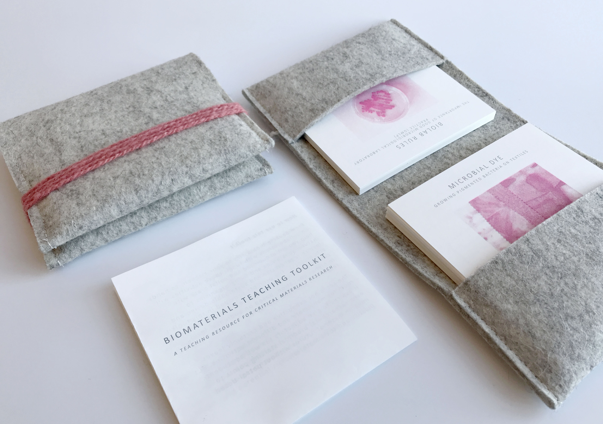

# Biomaterials Teaching Toolkit

> Materials can help to expose the cracks of our ailing systems; because they have the power to solidify new norms; because they can make more preferable futures tangible.

– Liz Corbin, materials researcher & designer

What you have in your hands is a teaching toolkit for critical materials research in higher design and arts education. It comes out of a 2-year project at the Amsterdam University of Applied Sciences, where we – a group of design educators and/or researchers –  developed ways to invite bachelor students to explore making practices that center ecosystems rather than human systems. With this toolkit, we share our tried and tested activities, which take bio-based design materials and their unique properties as a point of departure, and offer hands-on activities to critically engage in sustainable material research. 

This toolkit will provide you ways to see materials anew, by learning more about them, exploring alternatives, or altogether defamiliarising ourselves from what we think materials can and should do. 

## A critical, transdisciplinary approach to (material) making

The activities described in these cards invite learners to draw together insights from material science, industrial manufacturing, microbiology, material culture, design and arts as well as ancient crafts practices. Creating “new” natural materials here refers less to inventing novelty materials or being a contemporary nano-alchemist or genetic engineer. It refers to a new way of looking at materials that share a common characteristic: they are created from feedstocks that were once alive and regenerative. And more radically: some are biomanufactured by leveraging living systems without killing those living systems at all, instead enveloping them into making processes without depleting or destroying them. This toolkit helps you explore natural materials and growth processes in a hands-on way, while asking questions that unsettle what everyday human-made objects look and feel like, and the creative strategies, manufacturing processes and social and ecological systems involved in creating them.

## How to use this toolkit

From cooking bioplastics in your kitchen, to hands-on collaborations with fungi: these activities will help you get acquainted and collaborate with natural substances and living organisms to inspire regenerative and sustainable design and arts projects. The prompts provided in this toolkit can be combined to create longer programs in higher education, based on interest, audience, resources and time available. 

*Download the pdf files provided in this repository, and use them digitally, or print the cards on 250 g paper.*

### Themes and categories

The cards are structured around four themes that each contribute to understanding and making sustainable materials and sustainable modes of production. Depending on your aim and audience you can combine cards from the categories Materiology, Bio-based Materials, DIY Microbiology and Critical Making. Each category contains a mix of reflective, practical, creative and more conceptual activities. We recommend teachers explore each activity with peers first to get an understanding of the workflow, needs, and potential risks to be aware of. 

The set is not exhaustive and certainly leaves room for many more and different activities. But it aspires to give educators (as well as students, even researchers) practical starting points to imagine material futures without petrol-based plastics and toxic materials.

## Recommended suppliers (NL)

Finding the things you need can be a chore, here’s our list of recommended suppliers in the Netherlands: 

* Eurofysica – lab supplies for schools
* Labshop – lab supplies, chemical compounds, cellulose
* De Hekserij – chemical compounds, e.g., calcium chloride
* Unique Products – carrageenan and alginate (via Friedas.nl)
* Brouwland – light malt extract, activated carbon (bulk)
* De Molenwinkel – rye grain and wheat bran (bulk)
* Meervilt – mordants and natural dyes
* Belspo.be – microorganisms (institutional customers only)
* Mycelia.be – mushroom strains, consultancy & training
* Homegreen.nl – mushroom strains (also sporeless varieties)
* Carolina.de – slime mould sclerotium & educational materials
* Grown.bio – colonised substrates for DIY mycelium products
* Rotterzwam – DIY oyster mushroom growkit to do at home*
* Yaya Kombucha – kombucha starter kits*
* Startercultures.eu – cultures for food fermentation*

**Do not mix non-food and food applications and organisms. Keep utensils separate, don’t grow edibles in a biolab where other experiments also take place.**

## Disclaimer

This kit is presented solely for educational purposes. The authors and publisher do not offer it as professional services advice. The best efforts were made in preparing this kit, but the authors and publisher make no representations or warranties of any kind and assume no liabilities of any kind with respect to the accuracy or completeness of the contents and specifically disclaim any implied warranties of merchantability or fitness for a particular purpose. Neither the author nor the publisher shall be held liable or responsible to any person or entity with respect to any loss or incidental or consequential damages caused, or alleged to have been caused, directly or indirectly, by the information contained herein. 

## Colofon

Amsterdam University of Applied Sciences 
Faculty of Digital Media & Creative Industries 
Rhijnspoorplein 1, 1091GC Amsterdam 
[https://www.amsterdamuas.com](https://www.amsterdamuas.com) 

Funded by NRO Comenius Teaching Fellowship for educational innovation, awarded to Loes Bogers in 2020.  

| Title        	| Biomaterials Teaching Toolkit                                    	|
|:--------------	|:-----------------------|
| Authors      	| Loes Bogers & Sam Edens|
| Contributors 	| Micky van Zeijl, Ista Boszhard, Cecilia Raspanti|                
| Publisher    	| Amsterdam University of Applied Sciences|
| Partner      	| Textilelab Amsterdam, Waag |
| Typeface     	| Calibri |
| Paper        	| Biotop 80 g/m, Circle 250 g/m |
| Images       	| All images by authors and AUAS students unless stated otherwise. |

Many thanks to all our students for their wonderful participation, crazy ideas and honest feedback. 

The printed version of this toolkit is a limited edition. The booklet and cards are printed with soy-based ink on a RISO printer, on recycled and FSC-certified paper. The purse is made from 100% Oekotex certified undyed wool felt, sewn together with 100% silk yarn, and a hand-spun string made from Dutch wool. The wool can be mordanted and dyed with most natural dyes, such as madder, weld, cochineal or other. 

A digital version of the toolkit is available for download at: https://github.com/loesjebo/biomaterials_toolkit 

This work is licensed under a Creative Commons licence CC BY-NC-SA 4.0 (Attribution-NonCommercial-ShareAlike 4.0 International):
https://creativecommons.org/licenses/by-nc-sa/4.0/ 
